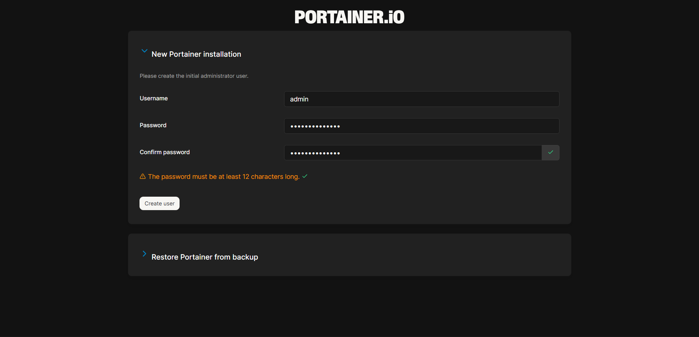
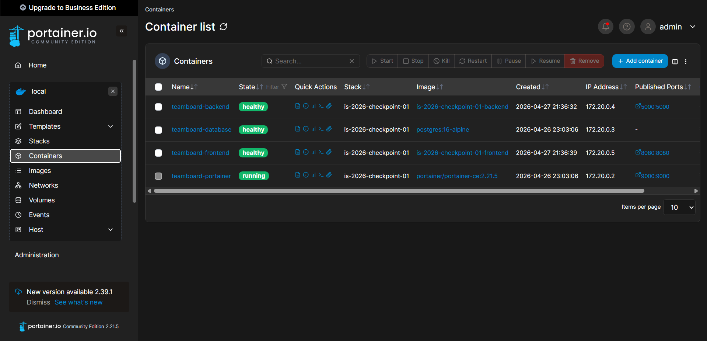
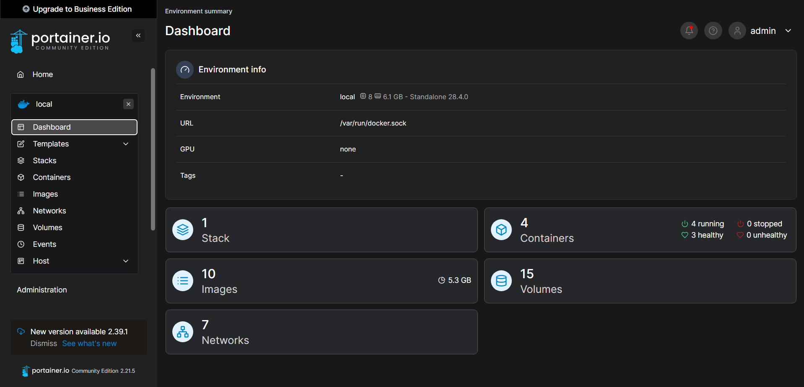
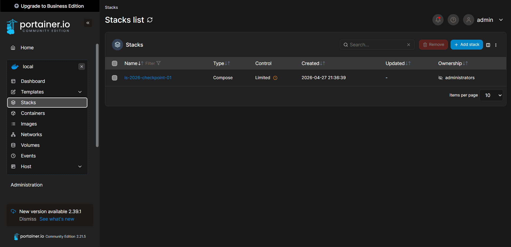

# is-2026-checkpoint-01
Repositorio destinado al Trabajo Práctico Checkpoint 01 para la cátedra Ingeniería y Calidad de Software - Comisión S41 - Año 2026

---

## Integrantes del equipo

| Nombre completo       | Legajo | Feature asignada                                                |
|-----------------------|--------|-----------------------------------------------------------------|
| Agostina Pascucci     | 33347  | 01-Coordinación, Infraestructura Base y README                  |
| Agustina Egüen        | 33191  | 02-Frontend — Página Web con HTML y JavaScript                  |
| Joaquin Montes        | 33459  | 03-Backend — API REST con Python y Flask                        |
| Santiago Talavera     | 33167  | 04-Base de Datos con PostgreSQL                                 |
| Nicolas Perez         | 33177  | 05-Panel de Monitoreo con Portainer                             |
| Justina Smith         | 33346  | 06-Feature adicional — Endpoint adicional + Documentación de API|

---

## Descripción

TeamBoard es una aplicación compuesta por frontend, backend y base de datos PostgreSQL, ejecutada con Docker Compose.

El proyecto también incluye Portainer como panel de monitoreo para administrar y visualizar los contenedores del entorno local.

---

## Servicios

### `frontend` — teamboard-frontend

Página HTML servida por un servidor HTTP de Python (python3 -m http.server).

> **Tecnología:**  Docker, Python 3.12-slim, python3 -m http.server, HTML, CSS, JavaScript, fetch()
> **Puerto:** `${FRONTEND_PORT}:8080`  
> **Función:** La página muestra: el nombre del grupo, una tabla con cada integrante (nombre, legajo, feature, servicio, estado) y un indicador visible de si el backend está respondiendo o no.

---

### `backend` — teamboard-backend

Capa intermedia entre el frontend y la base de datos. Expone una API REST con los datos del equipo que el frontend consume. 

> **Tecnología:** Docker, Python 3.12-slim, Flask, psycopg2, Gunicorn,variables de entorno 
> **Puerto:** `${BACKEND_PORT}:5000`  
> **Función:** API REST que gestiona la comunicación con la base de datos y le envía al frontend los datos que necesita. También se le asignó la funcionalidad de verificar el estado dinámicamente de cada servicio.

---

### `database` — teamboard-database

Almacena los datos del equipo que el backend sirve al frontend. 

> **Imagen:** `postgres:16-alpine`   
> **Tecnologías:** Docker, PostgreSQL 16-alpine, volúmenes nombrados, SQL, pg_isready
> **Puerto:** `${DATABASE_PORT}:5432` 
> **Función:** Almacenamiento persistente de datos de la aplicación
> **Volumen:** `postgres_data:/var/lib/postgresql/data`  
> **Script de inicialización:** `./database/init.sql`

---

### `portainer` — teamboard-portainer

Portainer CE es una interfaz web para administrar y monitorear contenedores Docker. Se utiliza en este proyecto para visualizar el estado del stack local de TeamBoard.

> **Imagen:** `portainer/portainer-ce:2.21.5`  
> **Tecnologías:** Docker, Portainer CE, socket de Docker, volúmenes nombrados 
> **Puerto:** `${PORTAINER_PORT}:9000`  
> **Volumen:** `portainer_data:/data` — conserva la configuración entre reinicios.  
> **Socket:** `/var/run/docker.sock` — permite a Portainer detectar y gestionar los contenedores locales.

---

## Requisitos

- Docker
- Docker Compose
- Archivo `.env` creado a partir de `.env.example`

El archivo `.env` debe definir las variables necesarias para levantar los servicios. Para Portainer, debe incluir:

```env
PORTAINER_PORT=9000
```

También deben estar definidas las variables de PostgreSQL y los puertos del frontend y backend.

## Clonar y ejecutar el proyecto

### 1. Clonar el repositorio

```bash
git clone https://github.com/agostinapascucci/is-2026-checkpoint-01.git
cd is-2026-checkpoint-01
```

### 2. Configurar las variables de entorno

Copiar el archivo de ejemplo y completarlo con los valores correspondientes:

```bash
cp .env.example .env
```

Editar `.env` con las variables requeridas:

```env
# Puerto del frontend
FRONTEND_PORT=<!-- ej: 3000 -->

# Puerto del backend
BACKEND_PORT=<!-- ej: 5000 -->

# Puerto de Portainer
PORTAINER_PORT=<!-- ej: 9000 -->

# PostgreSQL
POSTGRES_USER=<!-- usuario -->
POSTGRES_PASSWORD=<!-- contraseña -->
POSTGRES_DB=<!-- nombre de la base de datos -->
```

### 3. Levantar los servicios

```bash
docker compose up -d
```

### 4. Verificar que los contenedores estén corriendo

```bash
docker compose ps
```

Los servicios esperados son:

| Contenedor | Estado |
|------------|--------|
| `teamboard-frontend` | `running` |
| `teamboard-backend` | `running` |
| `teamboard-database` | `running` |
| `teamboard-portainer` | `running` |

### 5. Detener el proyecto

```bash
docker compose down
```

## Portainer

Portainer es una herramienta web para monitorear y administrar contenedores Docker. En este proyecto se utiliza para visualizar el estado del stack local de TeamBoard.

El servicio está definido en `docker-compose.yml` con la imagen `portainer/portainer-ce` y utiliza un volumen persistente para conservar su configuración.

También monta el socket de Docker:

```text
/var/run/docker.sock
```

Esto permite que Portainer pueda detectar y administrar los contenedores locales.

## Acceso a Portainer

Con el proyecto levantado, acceder desde el navegador a:

```text
http://localhost:${PORTAINER_PORT}
```

Si `PORTAINER_PORT=9000`, la URL es:

```text
http://localhost:9000
```

## Primera configuración de Portainer

Al ingresar por primera vez:

1. Crear el usuario administrador.
2. Seleccionar el entorno Docker local.
3. Confirmar la conexión con el entorno local.
4. Ingresar al panel de contenedores.

Desde Portainer se deben poder ver los contenedores:

- `teamboard-frontend`
- `teamboard-backend`
- `teamboard-database`
- `teamboard-portainer`

## Captura de Portainer





---
